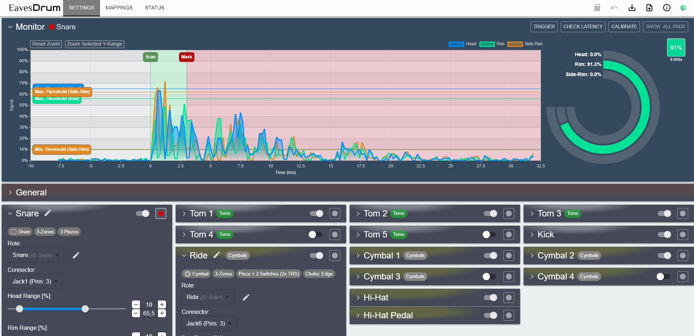

  

  No matter if you are E(a)ve or Ste(a)ve - drumming for e(a)veryone

  
  
  

<!-- vscode-markdown-toc -->
- [Welcome to EavesDrum!](#welcome-to-eavesdrum)
- [Features](#features)
- [Before You Start: Is EavesDrum What You Need?](#before-you-start-is-eavesdrum-what-you-need)
- [Getting Started](#getting-started)
- [Build Your Own EavesDrum Trigger Module](#build-your-own-eavesdrum-trigger-module)
  - [Use the Reference Design](#use-the-reference-design)
    - [PCB Ordering and Assembly](#pcb-ordering-and-assembly)
    - [Connector Harness](#connector-harness)
      - [Wiring the Single Pad Connectors](#wiring-the-single-pad-connectors)
  - [Make Your Own Design](#make-your-own-design)
    - [How the Circuit Works](#how-the-circuit-works)
      - [Over-Voltage Protection](#over-voltage-protection)
      - [Voltage Divider / DC Voltage Offset Generator](#voltage-divider--dc-voltage-offset-generator)
      - [Example](#example)
- [Configuration](#configuration)
  - [Calibration](#calibration)
  - [Settings](#settings)
    - [Generic Settings](#generic-settings)
    - [Pedal Settings](#pedal-settings)
    - [Apply Presets](#apply-presets)
  - [Mappings](#mappings)
  - [Apply a Whole Configuration](#apply-a-whole-configuration)
  - [Understand and Reduce Latency](#understand-and-reduce-latency)
- [Firmware Development](#firmware-development)
  - [How to Build the UI](#how-to-build-the-ui)
  - [How to Build the Backend and Firmware](#how-to-build-the-backend-and-firmware)
  - [How to Simulate a Drum-Kit on a PC](#how-to-simulate-a-drum-kit-on-a-pc)
- [About This Project](#about-this-project)
- [Other Related Projects](#other-related-projects)
- [License](#license)

<!-- vscode-markdown-toc-config
	numbering=false
	autoSave=true
	/vscode-markdown-toc-config -->
<!-- /vscode-markdown-toc -->

## Welcome to EavesDrum!

EavesDrum is an open-source e-drum trigger module project designed for drummers and makers.

It allows you to connect a multitude of drum pads or piezo triggers and convert their signals into MIDI events.

The configuration of the module is simple and user-friendly, thanks to a built-in WebUI. You can adjust sensitivity, threshold, and other parameters directly from your browser—no need for complicated software or direct hardware programming.

The trigger module acts as a USB MIDI device - simply connect it to your notebook and use drum software of your choice (EZdrummer, Addictive Drums, SSD5, ...) to convert your notebook into a complete drum module.

<figure>
  
  <figcaption>The EavesDrum Trigger Module</figcaption>
</figure>

<figure>
  
  <figcaption>DIY ultra-low-volume metal-mesh cymbal setup</figcaption>
</figure>

<figure>
  
  <figcaption>Conventional rubber-cymbal setup</figcaption>
</figure>

<figure>
  
  <figcaption>Low-volume mesh setup</figcaption>
</figure>

<figure>
  
  <figcaption>System overview</figcaption>
</figure>

## Features

- **Drum Trigger Inputs:**
  - With the EavesDrum PCB, you can connect your drum pads or piezo sensors to 32 analog inputs.
  - Each input can be mapped individually, for example to 16 TRS (3-pin Tip-Ring-Sleeve) connectors or 32 TS (2-pin Tip-Sleeve) connectors.
  - The [default configuration](#connector-harness) uses the following drum setup:
    - Snare (1x TRS for head/rim + 1x TS for side-rim)
    - 5x Toms (each with 1 TRS for head/rim)
    - Kick drum (1x TS)
    - Ride (1x TRS for bow/edge + 1x TS for cup)
    - 4x Cymbals (each with 1x TRS for bow/edge + 1x TS for cup)
    - Hi-Hat (1x TRS for bow/edge + 1x TS for cup)
    - Hi-Hat Pedal resistive or optical (connected to a dedicated connector with 3.3V or 5V supply voltage)
- **Compatibility:**
  -  EavesDrum is compatible with a wide range of [Roland (only non-USB), Yamaha, ATV and EFNOTE pads](#pad-connectors).
  -  The following pads were tested:
     - ATV XD-P10M/P13M 2-zone Drums
     - ATV aD-C14/C16/C18 3-zone Cymbals
     - EFNOTE EFD-S12P 3-zone Snare (head, rim, side-rim)
     - Roland PDX-8 2-zone Drum
     - Roland KD-10 Kick Pad
     - Zeitgeist ZG ECP 13" 3-zone Cymbal
     - Zeitgeist ZG CAD Cymbals (although the edge triggers unreliably due to the switch design)
     - Zeitgeist ZG ZKD7 Kick Pad
     - Drum-tec Hi-Hat controller (resistive)
     - DIY optical sensor (TCRT5000 based)
       - See sections below for schematics and Gerber files.
     - DIY drums and cymbals
       - See sections below for schematics and Gerber files.
- **MIDI Mappings:** 
  - Mappings are freely customizable via the UI.
  - It already contains Midi-Mappings for:
    - Addictive Drums 2
    - BFD Player 1.2
    - EZdrummer 3 (which can probably also be used as a base for your own Superior Drummer 3 mapping)
    - MT Power 2
    - Steven Slate Drums 5 (SSD5)
- **Low Latency:**
  - Latency is mainly determined by your audio interface and the selected scan time. With a decent audio interface, you can [reach a total latency of about 8ms](#latency).
  - You can measure the latency of your setup with the latency measurement feature built into the UI.
- **Affordable:** you might be able to make an assembled trigger module for approx. 20€.
  - See the section [Build your own EavesDrum trigger module](#use-the-reference-design).
- **Supported Microcontrollers:**
  - Raspberry Pi Pico 2 (recommended).
  - Raspberry Pi Pico.
  - A port for the Waveshare ESP32-S3 Pico with Wi-Fi UI and BLE MIDI was started but not finished.
    - As the Pico (2)W also supports Wi-Fi and BLE (not implemented yet), the only relevant difference to the Pico is that the ESP32-S3 has two instead of one ADC. In turn, USB network is more difficult than with Pico due to the TinyUSB implementation.

- **Open Source:** Source code and PCB Gerber files are available for customization and extension.
- **WebUI Configuration:** Browser-based interface for setting up and tweaking trigger parameters such as sensitivity, threshold, retrigger prevention, and more. No app required as the UI runs directly on the trigger module.
  - Monitor the signal of your drum pads in real time so that you can see the effect of your settings.
  
  - Provides extensive settings options within a (hopefully) user-friendly layout.
  
  - Mappings can be adjusted individually or for the whole kit.
  

## Before You Start: Is EavesDrum What You Need?
**EavesDrum is for you if you:**
  - need more / additional trigger inputs to those that standard drum kits support.
  - want to mix drums from different vendors as most drum kits only work well with their own pads.
  - want to start drumming and do not want to pay a fortune for a drum kit.
  - want to diagnose or improve the trigger behavior of your drum pad.
  - have fun making stuff and just want to build your own drum kit or implement your own drum module features.

**EavesDrum might not be for you if you:**
  - want to use the module for live performances as it does not give any guarantee error-free operation at all times or conditions.
  - want a drum module that works standalone without a Notebook.
  - want a drum module that works out-of-the-box, as you will have to tweak the settings according to your pads via the UI.
  - need cross-talk cancelation, positional sensing or decay curves, as these features are not implemented (yet).

> [!IMPORTANT]
> **Disclaimer:** Although EavesDrum has been tested with various drum pads and setups, it remains a DIY hardware project and may behave differently depending on your specific configuration. Connecting this module to your equipment is done at your own risk. I cannot be held liable for any damage, malfunction, or injury resulting from its use. Please ensure compatibility and take appropriate precautions before integrating it into your setup.

## Getting Started

0. **Prerequisites:**
All you need is:
    - A computer with a drum software (see [MIDI Mappings](#midi-mappings) to give you a short overview).
      - A PC or Mac is recommended.
        - although there is no minimum requirement, a slow CPU might increase the [Latency](#latency).
      - An Apple iPad with Garage Band might also work, but you need an Apple Camera Connection Kit if your iPad still has a lightning but no USB-C connector. BLE Midi is not yet supported.
      - An Android smartphone / tablet is not recommended due to the lack of good drumming apps.
    - A decent audio interface with low latency, preferably one with dedicated ASIO drivers. See [the section about latency](#latency) for more information.
    - Something to drum on, i.e. drum pads, cymbals and a Hi-Hat pedal. Or just a cheap piezo if you want to DIY your own drum.

1. **Build the EavesDrum trigger module:** 
   - Either built it yourself or order it via a PCB manufacturer of your choice
   - See section [Build your own EavesDrum trigger module](#use-the-reference-design) for schematics and Gerber files

2. **Download & Flash the firmware:** 
   - Download the firmware for your Pico board from the Release download section
   - Press the BOOTSEL while connecting your Pico Board via USB to enter the bootloader mode
   - The board will now be detected as an USB flash drive
   - Drag & Drop the firmware .uf2 file onto the drive
3. **Start the WebUI:** 
   - After flashing is done, the device should be detected as an USB network device
   - Open your browser and navigate to the WebUI by entering either
     - the static IP <a href="http://192.168.7.1">http://192.168.7.1</a> or
     - the DNS name <a href="http://eaves.drum/">http://eaves.drum</a>
4. **Calibrate:** 
   - [Calibrate the voltage offset with the UI Wizard](#calibration)
5. **Connect Drums:** 
   - Connect your drum pads or triggers to the EavesDrum hardware
6. **Configuration:** 
   - Adjust [settings](#settings) and [MIDI mappings](#mappings)
7. **Play:** 
   - Once configured, start playing and enjoy!

## Build Your Own EavesDrum Trigger Module
### Use the Reference Design
**Schematics of the trigger module with 32 inputs:**

You can find the schematics and pcb files in the `doc/schematics/module` directory. They can be viewed and edited with [KiCad](https://www.kicad.org/).

**Bill of material (BOM):**
| Comment | Designator | Quantity | Price / Unit | Price Total | Comment |
| ------- | ---------- | -------- | ------------ | ----------- | ------- | 
| Raspberry Pi Pico 2 | A1 | 1 | 5.50€ | 5.50€ | <ul><li>There is also a variant Pico 2H with an already soldered header</li><li>A Pico 1 would also work but is not recommended due to the better performance of the Pico 2 and the little difference in price.</li><li>Pico 2W is not yet supported but might be in the future for Wifi and BLE</li></ul>|
| 20-pin Header (male) 20-pin Header (female) | A1 | 2 | 0.20€ 0.30€ | 1.00€ | Optional. <ul><li>Used to socket your Pico to be able to replace it when it is damaged or exchange it by another variant like the Pico 2W.</li><li>If you use the Pico variant that already has a header. Then you only need the female header.</li></ul> |
| HC4067 | U1, U2 | 2 | 1.00€ | 2.00€ | Multiplexer. Each provides 16 inputs. Available from many vendors with HC4067 in the name (e.g. CD74HC4067M). Make sure it is the SO-24 package. |
| BAT54S | D1.0 - D1.15 D2.0 - D2.15 | 32 | 0.05€ | 1.60€ |Prefer the ones with a forward voltage (VF) of 800mV@100mA over those with 1V@100mA but probably any vendor and type will work.|
| LED (red) | D3 | 1 | 0.08€ | 0.08€ | Use any color of your choice. THT or SMD 0805 / 0603 packages are supported. |
| LED (blue) | D4 | 1 | 0.10€ | 0.10€ | Use any color of your choice. THT or SMD 0805 / 0603 packages are supported. |
| Push Switch | SW1, SW2, SW3 | 3 | 0.15€ | 0.45€ |6x6mm. Only the `RESET` button is used at the moment. |
| Potentiometer 5k | R3, R6 | 2 | 0.35€ | 0.70€ | Supports Piher PT10 (10mm) / PT5 (5mm) or Bourns TC33 (SMD) |
| Potentiometer 100k | R11 | 1 | 0.35€ | 0.35€ | Supports Piher PT10 (10mm) / PT5 (5mm) or Bourns TC33 (SMD) |
| Resistor 330 Ohms | R5, R8, R13 | 3 | 0.03€ | 0.09€ | SMD 0805 package, 125mW, 1% |
| Resistor 1 kOhms | R1.0 - R1.15 R2.0 - R2.15 | 32 | 0.015€ | 0.48€ | SMD 0805 package, 125mW, 1% |
| Resistor 2.7 kOhms | R4 | 1 | 0.03€ | 0.03€ | SMD 0805 package, 125mW, 1% |
| Resistor 4.7 kOhms | R9, R10 | 2 | 0.03€ | 0.06€ | SMD 0805 package, 125mW, 1% ||
| Capacitor 10 µF | C1, C2 | 2 | 0.04€ | 0.08€ | SMD 0805 package, >=25V, X5R (or X7R)
| D-Sub 37-pin Connector, right-angled, male | J1 | 1 | 1.00€ | 1.00€ | Alternatively, you can use any connector of your choice via the 2x25 pin IDC header (J2). |
| Header 2x25 pins (male) | J2 | 1 | 0.33€ | 0.33€ | Optional. Only required if you do not want to use the D-Sub 37 connector.
| 3-pin Header (male) + 2-pin Jumpers | JP1 - JP6 | 6 | 0.09€ + 0.02€ | 0.66€ | Instead of 6x 3-pin headers, use a cheaper 40-pin header and brake it into 3-pin pieces. You can also use slide switches instead if you want to change the settings more often.
| 3-pin Header (female) | J3 | 1 | 0.15€ | 0.15€ | Only required for UART serial debug output.
| PCB | - | 1 | ~10€ (Germany) | ~10€ | See the section [PCB Ordering and Assembly](#pcb-ordering-and-assembly) for more info|
| **Total** |||| 24.66€ || 

If you are located in Germany, check prices at Reichelt (that's where the prices from above are from), Pollin, Conrad. Globally Mouser and Farnell might be your friend.

#### PCB Ordering and Assembly
All you need to order your Trigger Module PCB v1.1 for assembly are the following files:
- [GERBER File](https://github.com/tobigun/EavesDrum/releases/download/PCB-module-v1.1/GERBER-eavesdrum-module-1.1.zip)
- [BOM File (Bill of Material)](https://github.com/tobigun/EavesDrum/releases/download/PCB-module-v1.1/BOM-eavesdrum-module-1.1.csv)
- [CPL File (Component Placement List)](https://github.com/tobigun/EavesDrum/releases/download/PCB-module-v1.1/CPL-eavesdrum-module-1.1.csv)

You will also find all files on the [PCB Module 1.1 Release Page](https://github.com/tobigun/EavesDrum/releases/tag/PCB-module-v1.1).

**To order the PCB:**
- Open the website of a PCB manufacturer.
  - The most famous ones are probably JLCPCB and PCBWay from China.
  - There is also Aisler (Germany), EuroCircuits (Europe) and probably more if you want to produce your PCB in Europe instead of China.
  - Choose whatever suits you best.
- Upload the GERBER zip-file. The site should show you a preview of the PCB now.
- You can leave the default settings.
  - (Recommended) Change `Surface Finish` from `HASL (with lead)` to `LeadFree HASL` to protect our environment from toxic lead
- For delivery "EuroPacket" or "Global (Standard) Direct" might be your choice.
  - Both variants will ship your PCBs together with other PCBs in a big package to an importer in your home country (or a neighbored country). The package will then be split into smaller packages and sent to you. This is cheaper and will probably also save you the hassle of customs as this will be done by the importer.
  - The shipment time is a bit longer than with other more expensive delivery options. But with all options the parcel will probably spent several days in the customs office, so time savings is not that much noticable.

*Examples:*
- JLCPCB: 4€ - Coupons + Shipping/Taxes
  - Shipping to Germany: Global Standard Direct: 1.50€ / EuroPacket: 5.50€ + Tax: ~1€
- PCBWay: 5€ - Coupons + Shipping/Taxes
  - Shipping to Germany: ~5€ with Global Direct + Tax: ?

Due to the varying discount by coupons, prices of JLCPCB and PCBWay my vary. So check both.

**Assembly**
It is possible to assemble the PCB on your own by hand-soldering without special equipment. The only tricky part is the HC4067 SMD packages and the SMD resistors and capacitors. While the latter is quite easy, the HC4067 requires some experience.

You can also let JLCPCB or PCBWay assemble the PCB as you already order the PCB there.

*Example:*
- JLCPCB: 5 assembled PCBs including parts cost about 90€ (excl. shipping/tax), so approx. 20€ per PCB.
  - Unfortunately the minimum amount of assembled PCBs per order is 2 (in this case ~60€ excl. shipping/tax, so 30€ per board).

If you want an assembled board it is best to organize a collective order to split the cost.

**To order an assembled PCB:**
- Perform the same steps as for the normal PCB but select "PCB Assembly".
- If you use JLCPCB in the next step you are asked for the BOM and CPL files that you have to upload.
- Some parts might currently not be available. There is most likely an identical component / chip from a different vendor that you can select in this case.
- In the next step check the component placements and submit your order.
- After a review an engineer might contact you if there are questions about the design (that was the case in my order).

#### Connector Harness

In addition to the trigger module you will have to build your own adapter to connect the drum pads. Here is the pin out of the D-Sub 37 connector:

The pin names consist of the multiplexer Id (in1_x: input x of Multiplexer MP1, in2_x: input x of Multiplexer MP2). Some of the pin's functions (sel0-4) can be selected by the jumpers / slide switches with the same name. Set them to the in2_x function. The GPx option is only used if you want to experiment with capacitive touch.

You can either solder jacks directly to a D-Sub 37 (female) connector or you can build an adapter to one of the cable harnesses that come with drum modules.

This is the default configuration for the outputs:
| Jack | Pins | Assignment |
|-----------|------|------------|
|1| in1_0, in1_1, in1_2 | Snare (Main, Rim, Side-Rim) |
|2| in1_3, in1_4 | Tom 1 (Main, Rim) |
|3| in1_5, in1_6 | Tom 2 (Main, Rim) |
|4| in1_7, in1_8 | Tom 3 (Main, Rim) |
|5| in1_9 | Kick Drum |
|6| in1_10, in1_11, in1_12 | Ride (Bow, Edge, Cup) |
|7| in1_13, in1_14, in1_15 | Cymbal 1 (Bow, Edge, Cup) |
|8| in2_0, in2_1, in2_2 | Cymbal 2 (Bow, Edge, Cup) |
|9| in2_3, in2_4, in2_5 | Cymbal 3 (Bow, Edge, Cup) |
|10| in2_6, in2_7, in2_8 | Hi-Hat (Bow, Edge, Cup) |
|11| in2_9, in2_10 | Tom 4 (Main, Rim) |
|12| in2_11 (sel0), in2_12 (sel1) | Tom 5 (Main, Rim) |
|13| in2_13 (sel2), in2_14 (sel3), in2_15 (sel4) | Cymbal 4 (Bow, Edge, Cup) |
|Pedal| adc2, hh_vcc (optical only) | Hi-Hat Pedal (resistive or optical)<ul><li>For resistive controllers: adjust the `ADC2 DC offset` potentiometer to the (+) direction (~4kOhm)</li><li>For optical (TCRT5000) controllers: adjust the `ADC2 DC offset` potentiometer to the middle (~69kOhm)</li></ul>This will adjust the sensitivity of the ADC2 channel. You can fine-tune this setting in the UI later. |

##### Wiring the Single Pad Connectors

The wiring of **Snares and Toms** is straightforward in most cases
- Almost all companies use the Roland style 2-Piezo 1xTRS layout
- Yamaha uses switches for Edge and Side Rim
- EFNote adds a dedicated Side-Rim zone with another Piezo

<table>
<thead>
  <tr>
    <th>Tom/Snare</th>
    <th>Main/Head (Piezo)</th>
    <th>Edge</th>
    <th>Side-Rim</th>
    <th>EavesDrum Setting</th>
  </tr>
</thead>
<tbody>
  <tr><td>Generic 1-Zone</td><td>Tip</td><td>-</td><td>-</td><td>Drum / 1-Zone / Piezo</td></tr>
  <tr><td>Roland 2-Zone</td><td>Tip</td><td>Ring</td><td>- (Cross-Stick sound is generated by module)</td><td>Drum / 2-Zones / 2 Piezos</td></tr>
  <tr><td>Yamaha 3-Zone</td><td>Tip</td><td colspan='2'>Ring (Switches for zones are multiplexed by a 10k resistor)</td><td>Drum / 3-Zones / Piezo + 2 Switches (1x TRS)</td></tr>
  <tr><td>EFNOTE 3-Zone</td><td>Tip (Main Jack)</td><td>Ring (Main Jack)</td><td>Tip (Side-Rim Jack)</td><td>Drum / 3-Zones / 3 Piezos</td></tr>
</tbody>
</table>

**Cymbals** (with 3-Zones) follow two main connection styles:
- Roland style with 2x TRS Jacks (labeled "Bow/Edge" and "Bow/Bell")
- Yamaha style with 1x TRS Jack. Bell and Cup switch connected to the "Ring" pin (multiplexed by a 10k resistor)

If you have only a one or two zone cymbal the pin layout is the same for both vendors.

<table>
<thead>
  <tr>
    <th>Cymbal</th>
    <th>Bow (Piezo)</th>
    <th>Edge Switch</th>
    <th>Bell/Cup Switch</th>
    <th>EavesDrum Setting</th>
  </tr>
</thead>
<tbody>
  <tr><td>Generic 1-Zone</td><td>Tip</td><td>-</td><td>-</td><td>Cymbal / 1-Zone / Piezo / No Choke</td></tr>
  <tr><td>Generic 2-Zone</td><td>Tip</td><td>Ring</td><td>-</td><td>Cymbal / 2-Zones / Piezo + Switch / Choke: Edge</td></tr>
  <tr><td>Roland 3-Zone</td><td>Tip (Jack "Bow/Edge")</td><td>Ring (Jack "Bow/Edge")</td><td>Ring (Jack "Bow/Bell")</td><td>Cymbal / 3-Zones / Piezo + 2 Switches (<b>2x</b> TRS) / Choke: Edge</td></tr>
  <tr><td>Yamaha 3-Zone</td><td>Tip</td><td colspan='2'>Ring (multiplexed by a 10k resistor)</td><td>Cymbal / 3-Zones / Piezo + 2 Switches (<b>1x</b> TRS) / Choke: Edge</td></tr>
</tbody>
</table>

See also:
- [Cymbal wiring diagram at edrums.github.io](https://edrums.github.io/en/diy/cymbal_switch/) for the wiring difference between Roland and Yamaha cymbals.
- [Yamaha compatibility matrix](https://de.yamaha.com/de/download/files/2094396/) for an overview of the Tom and Cymbal models

### Make Your Own Design

In case you do not want to use the reference design or you just need a few inputs, you can also design your own trigger module and just use the firmware.
The base circuit for each input consists of the following parts:

You might also be able to build this on a breadboard for first experimentation.

#### How the Circuit Works
Skip this section if you are not interested in the electronic background of the circuit.

##### Over-Voltage Protection
- Two clamping diodes restrict the signal to the range between 0V - 3.3V
  - Protects the ADC input pins of the microcontroller
  - Prevents cross-talk between inputs if a Multiplexer (e.g. 74HC4067) is used
- Note that Schottky diodes with a low forward voltage have to be used here
  - They react faster than a conventional (Silicon P-N-junction) diode to over voltage spikes
  - The BAT85, BAS85 (SMD variant of the BAT85) and BAT54S (two diodes in one SMD package) diodes work fine

##### Voltage Divider / DC Voltage Offset Generator
- The resistors R1 and R2 form a voltage divider that halfs the operation voltage (Vcc=3.3V) to generate a ~1.65V DC offset voltage
  - This is necessary to sample the full signal with its positive and negative half-wave
  - Note that R1 is a variable resistor (potentiometer) as the circuit is usually not that perfect that R1=R2 gives you half the operation voltage as it should in theory
- Together with R3, R1 and R2 scale the voltage of the piezo to the range of 0V - 3.3V that can be sampled by the ADC
  - This is necessary as the voltages of a piezo can be rather high.
  - If you want to play with the values there is an [LTSpice simulation here](doc/simulation/drum-trigger.asc) but keep in mind that the piezo model does not act like a real one.
- Simpler approaches without an offset voltage are also possible, e.g. by just clamping the signal with a zener diode to just keep the positive half-wave of the signal
    - Although this works, you will have to pay attention to the polarity of the piezos
    - If the piezo starts with a negative half-wave, you will miss it and thus will add latency of approx. 1ms
    - This is even worse, if you use two piezos for head and rim, as the wrong zone might be triggered if the first half-wave of one piezo is missing but missing for the other.

##### Example
Here is a simple example with a high intensity hit on a snare drum: The left shows the input signal that is offset by 1.65V and it fits nicely into the 0V - 3.3V range. On the right you see the display in the UI. All the details of the signal are maintained. Note that the firmware maps the negative part of the signal to the positive y-axis so that the thresholds can be edited more easily.

## Configuration

### Calibration
Before you can start you have to first adjust the DC voltage offset so that the signal level is at 0% when no pad is hit. But no panic - the process is easy and only has to be done once.

For this open the WebUI, open the settings page (should be open by default) and click on `Calibrate` in the `Monitor` panel and follow the instructions.

At the beginning the signal graph will probably look like this, with a signal level above 0% (here 10%):

Now turn the potentiometer labeled `ADC0 DC offset` (R3) with a screwdriver. Only if turned in the correct direction, the signal level will decrease, otherwise it will increase. So turn the potentiometer until the signal level reaches 0%. If you turned too much, the signal level will increase again - in this case turn in the opposite direction.

The signal graph should now look like this - with a signal level of 0%:

Now the calibration is completed.

> [!INFO]
> Do not worry if the signal is not totally clean and has a bit of a ripple in the 1% or 2% range. This can be compensated with the thresholds later.
> If you do not reach the 0% level at all, your trigger module might be faulty.

### Settings

To optimize the trigger behavior for your pad, go to the settings page and open the panel of the pad you want to adjust.

First assure that the Drum type (here: Drum / 3-Zones / 3 Piezos) is correct. If you are not sure, check [the section about the different pad connectors](#pad-connectors) to see what the type should be.

Mark the pad as monitored (the record button on the right top of the pad's panel). This way you can see the signal graph (left) and hit graph (right) in the `Monitor` panel whenever you hit the monitored pad. Right next to the hit graph is the hit history which shows you the last hits. You can also click on one of the last hits to see the graphs again.

If you click on `Show All Pads` on the top, you can see hits on every pad, no matter if it is monitored or not.

#### Generic Settings

- **Main/Head/Rim/Edge/Cup/... Range**: trigger range for each zone
  - The **min. value of the range** specifies the sensitivity.
    - You should set it as low as possible without having the pad trigger when you do not hit it.
  - The **max. value of the range** specifies the signal level that marks 100%.
    - Set it in a way that you can reach a signal level of 100% when you hit the pad the hardest way you would in your playing style.
    - If you set the max. too low, the detected signal level will be 100% even if you did not hit the pad with the highest intensity.
  - If you enable monitoring for the pad it should be easy to find the correct values.
  - For cymbals with switches for edge and cup you will only have a **minimum threshold** for each switch instead of a range.
    - This determines at which level the switch is considered to be closed or opened.

- **Scan Time** determines the time to search for a peak
- **Mask Time** can be used to reduce false retriggers
- **Curve Type** lets you change the trigger behavior for low or high intensity hits, i.e. you can shift the sensitivity more to the lower or higher intensities
- **Head/Rim Bias** is only for drums (i.e. snares and toms) with at least two zones. If you move the bias more to the rim (i.e. to the right), the rim zone will more likely be triggered if both zones were hit at once. This is useful to assure that rimshots trigger the rim sound.

> [!IMPORTANT]
> When you change settings they will be applied immediately but they will be reset to the old values when EavesDrum reboots or loses power. To keep the settings you have to save them with the "Save" Button (SD-Card icon) in the top Icon Bar.

#### Pedal Settings
The settings for the Hi-Hat pedal are different from the settings of the pads.

To see the effect of the settings, monitor the pedal with the record button

- **Pedal Range**: determines the offset and threshold for the lowest and highest signal level
  - Do not touch the Hi-Hat pedal for the open position.
  - Adjust the **min value** of the `Pedal Range` so that the corresponding marker in the monitor's signal graph is slightly above the current pedal signal and the Pedal value in the hit graph is at 0%.
  - Next, close the Hi-Hat pedal.
  - Now adjust the **max value** of the `Pedal Range` so that the corresponding marker in the monitor's signal graph is slightly below the current signal and the hit graph shows 100%.
  - When you move the pedal now, you should get the full range between 0% and 100% in the hit graph, and it should stay at 0% when open and at 100% when closed.
- **Move Detection Tolerance** this determines how much the pedal has to be moved to change its value. A smaller tolerance gives you a higher resolution but is more prone to noise in the signal.
  - Press the Hi-Hat pedal to a position between open and closed. Try to keep this position - the value in the hit graph should not change. If it does, you might decrease the tolerance until the hit graph value is stable.
- **Pedal State Thresholds** and **Chick Detect Timeout**:
  - When the pedal travels from the `Almost Closed` position to the `Closed Position` a "Chick" sound detection takes place.
  - The faster the pedal moves from `Almost Closed` to `Closed` the higher the intensity of the "Chick" sound will be.
  - If the time between both states is higher than **Chick Detect Timeout**, then no sound will be played.
  - If you do not want a "Chick" sound, you can disable it on the Mappings Page by setting the sound for the "Chick" to `None`.

#### Apply Presets
In the folder `config/presets` you can find some presets for some pads. You can apply them by dragging them from Windows Explorer to the settings panel of a pad.

### Mappings

With the Mappings page you can change the MIDI mappings of each pad.

Select the MIDI note of the zone to the desired value. You can trigger the note via the UI by pressing the "Play" button to preview the sound.

> [!IMPORTANT]
> When you change mappings they will be applied immediately but they will be reset to the old values when EavesDrum reboots or loses power. To keep the settings you have to save them with the "Save" Button (SD-Card icon) in the top Icon Bar.

**Apply Drum-Kit Mappings**
You can change the mappings of all pads in the drum-kit at ones if you drag & drop a mapping file (see folder `/config/mappings`) to top border (aka the Icon Bar) of the UI. This way you can switch between the mappings of the drum softwares easily.

Alternatively you can also click on the "Apply Config File" button in the top Icon Bar to open the same file drop area that appears if you drag & drop a file.

If you drag & drop the mappings file onto a pad instead of the top bar, only this pad's mappings will be changed:

**Roles**
Note that the mappings are assigned to a `role` (e.g. Snare, Tom1, ...) and not to a pad directly. As the drum kits differ in number and type of pads it would be rather difficult to have generic mapping files if there is no common denominator for every drum. This is what the role is for: it specifies the role of the drum in the drum kit, so that you have the correct mappings assigned to the drum when you switch from one mapping file to another.

### Apply a Whole Configuration
If you want to have more control over a configuration you can download the active configuration with the "Download" icon in the top Icon Bar. Then do you modifications on the downloaded YAML file and upload it again by either clicking on the "Apply Config File" button in the Icon Bar or by Drag & Drop of the config to the Icon Bar.

This way you can Backup & Restore your config whenever you do a firmware update.

 

### Understand and Reduce Latency
At a speed of sound of about 343 m/s, the sound travels 34 cm in 1 ms, so a little less then the length of a drum stick. It seems that everything up to [5 ms is not noticeable and most drummers still have no problem with 10 ms](https://forums.steinberg.net/t/ab-welcher-latenz-bemerkt-ihr-eine-verzogerung-und-ab-wann-stort-die-euch/105517/45). So you want the latency to be as low as possible or at least below 10 ms.

If you look at the signal path there a quite some components involved from the hit to the drum until you hear the sound from the speaker. This is round trip time (RTT) of your system which defines the latency of your signal.

1. The **hit detection** by the trigger module will take a fixed time - the scan time that you selected in the pad's settings and that is by default 3 ms. You can try to reduce this time but if you take a look at the screenshot of the Monitor below you might notice that the piezo signal for some pads reaches its peaks only after 1, 2 or even 3 ms. So if you set the scan time too low, you might get wrong results. The default of 3 ms was chosen so that it will work with most drum pads.

2. The time it takes the trigger module to **generate and transfer a MIDI message to the computer via USB** is negligible as it is only a small fraction of a ms.
3. Although the **sound processing** might also take some time I did not notice a vast differences between the drum softwares.
4. The audio latency from your drum software to the **audio interface** is the biggest contributor to latency.
   - It depends on the **number of buffers** the software, drivers and audio interface uses and the **buffer size**.
     - Dedicated audio interfaces for musicians are optimized for low latency and offer better (ASIO) drivers.
     - The bigger the buffer the less error-prone is the playback, even if the CPU is currently doing some other stuff. But every buffer and every byte in the buffer will increase the latency.
   - The best way to reduce latency is to **reduce the buffer sizes**. The goal is a **latency of 5-6 ms** for this part of the signal chain.
     - On **Windows** this is **only possible** without crackling and dropouts **with ASIO drivers**. So make sure your audio device has dedicated ASIO drivers.
     - Do not waste your time with **WASAPI** or **DirectSound** drivers. WASAPI (Low-Latency) resulted in 69ms, WASAPI (Exclusive Mode) in 34.9ms. DirectSound was even worse. Same device with ASIO was about 6ms.
     - You can try **[ASIO4All](https://asio4all.org/)** if you want to start with an existing interface that does not come with ASIO drivers - but keep your expectations low. With the Realtek soundcard built into one of my notebooks I could not get the latency below 35 ms with ASIO4All which is unusable.
   - **Select ASIO as the output type** in your drum software and start with the lowest audio buffer size.
     - Trigger the pads really quick and try every pads if you hear some crackling or dropouts on any of them.
     - Also check if the audio quality is still ok or if it sounds muffled, ...
     - If you notice audio problems (**crackling, muffling, popping, dropouts**)
       - Make sure that no other CPU-intensive software is currently in use.
       - Also make sure that your CPU is suited for the task (i.e. you CPU load is not too high)
       - Although my old Intel Core i7-7500U (2.7 GHz) Ultrabook CPU from 2016 works fine as drum computer most of the time, it seems to stutter sometimes if I select the lowest buffer size. Something I have not noticed with my newer Intel Core i7-1260P (2.1 GHz, 12 Cores) from 2022.
       - If you have a modern i7 (and probably i5) CPU you should be fine. Same with an Apple M1 CPU.
     - If you still notice audio problems **increase the sample size step by step** until you get a stable output.
   - Note that the latencies that your ASIO driver displays for each buffer size (e.g. 64 samples -> 1.5 ms) is only the **theoretical minimum** with this setting. In reality the value is much higher (e.g. for my device 5 ms instead of the 1.5 ms). You can measure the system latency if you want to be sure (see below)
   - Sometimes you can further reduce the latency by **increasing the sample rate** (so 192kHz, 96kHz or at least 48kHz instead of 44.1kHz), but this might not always give you the expected result.
   - Last but not least the **OS** might also be a factor. If you have the choice try Mac OS X or iOS - it might perform better due to its superior audio architecture.

**TL;DR**
To reduce the latency, use a decent Audio interface, use dedicated ASIO drivers, reduce the sample size and try to increase the sample rate. You should get the output latency of the audio device to about 5-6 ms with ASIO on Windows. So with a scan time of 3 ms this will be 8-9 ms. If you are still not satisfied with this, try to reduce the scan time of the pads.

You can test the latency of your system with the latency measurement feature, built into the UI. Open the `Settings` page and click on `Check Latency` on top of the `Monitor` panel. The wizard will guide you through the procedure.

---

Below are the measurement results from the audio interfaces that I own. Maybe it will give you an idea what to expect:
|Device|Sample Rate|Buffer Size|ASIO driver|Latency|Comment|
|------|-----------|-----------|-----------|-------|-------|
|Behringer UMC204HD|**48kHz**|32 (0.7ms)|UMC ASIO|5.7ms||
|Behringer UMC204HD|**96kHz**|32 (0.3ms)|UMC ASIO|5.2ms||
|NUX Mighty Plug (Pro)|48kHz|8 (0.2ms)|NUX Audio|6.9ms|A guitar effect plug, so maybe not what you want.|
|Terratec Aureon 5.1 USB MK.2|48kHz|64 (1.3ms)|ASIO4All|5.9ms||
|Conrad UA0078 (CMedia CM108 chip)|48kHz|64 (1.3ms)|ASIO4All|6.6ms||
|Realtek HD Audio (HW Dev-ID 0x0293)|44.1kHz|64 (1.5ms)|ASIO4All|6.4ms|Could be an ALC293. The latency was not constant between tests and reached in a few instances 12, 23 and even 40ms. Realteks ASIO driver was not available on the computer.|
|EFNote 3 as Audio Interface|48kHz|32 (0.7ms)|EFNOTE|8.2ms|Measured with my 9 year old Notebook. Got about 13ms on my newer Notebook with the same setup.|
|Noname USB-C headphone adapter (AB13X)|44.1kHz|64 (1.5ms)|ASIO4All|23.8ms||
|Realtek HD Audio (HW Dev-ID 0x0294)|44.1kHz|64 (1.5ms)|ASIO4All|34.9ms|Could be an ALC294. Realtek's ASIO driver crashed, so I had to use ASIO4All|

*Notes*:
* The folder `doc/latency` contains screenshots of all tests
* The measurements were performed multiple times and the results varied slightly (~0.5 - 1ms) between tests. I took a result with a representative value.

**Conclusion**
> - The only dedicated device (Behringer UMC204HD) performed best.
>   - Focusrite Scarlett Solo 3rd / 4th Gen also comes with ASIO drivers and might work as well
>   - You can PM me your results. Would be quite interesting
> - The results can vary between Computers and sometimes a 9 year old Computer can give you better results than a new one (see EFNOTE 3)
> - Although some ASIO4All performed quite well and I did not notice any crackling during the short test, I would not recommend them, as crackling is still likely with them. But it might be a start if you already own them.

## Firmware Development
EavesDrum already comes with pre-built releases. So you do not need to build it yourself. In case you want to change the code, here are the steps to build the firmware yourself.

 

### How to Build the UI
- Install [NodeJS](https://nodejs.org/en)
- Open the project directory in a terminal (cmd or git bash)
- Change directory to the `webui` directory
  - `cd webui`
- Install the dependencies with NPM
  - `npm install`
  - (This will require NodeJS and NPM, which should be installed with NodeJS. If the command does not work, make sure that the binary path of NodeJs is in your environment PATH)
- Now build the UI with `npm run build`. The result should be written to the `data` directory in the root directory of the project
- You can also start `npm run serve` to start a server on `http://localhost:8080`. This will proxy requests either to the [PC simulation](#simulation) or to the hardware device, depending on the selected target in `vite.config.ts`.
  - If you set the target to the hardware device you can test UI changes without building a new firmware.

### How to Build the Backend and Firmware
- Download and install [Visual Studio Code](https://code.visualstudio.com/)
- Open Visual Studio Code and install the [PlatformIO](https://marketplace.visualstudio.com/items?itemName=platformio.platformio-ide) extension
- Download the EavesDrum code from this repository via Git or zip
- Open the root directory of this project (the one with the `platform.ini` file) in Visual Studio Code
- Select the target ("pico2" is recommended)
- Press `build`
- Press `upload`
  - Per default the Raspberry Pi Debug Probe is selected to upload the firmware
  - Change `upload_protocol` from `cmsis-dap` to `mbed` in the `platform.ini` file (section `pico-base`) if you do not have a Debug Probe and want to upload the firmware per USB instead. This will create an UF2 file and flash it via the flash-drive in bootloader mode.
    - If the upload fails, try to enter the bootloder manually by pressing the `BOOTSEL` button of the Pico when connecting it via USB (or alternatively pressing the `RESET` button if you use the EavesDrum PCB).
- Click on the `Platform` / `Upload Filesystem image` task in the PlatformIO tab (click the side-bar icon with the PlatformIO ant logo to open the menu first)
  - Important: this requires that the WebUI is setup first. Follow the steps of [How to build the UI](#how-to-build-ui) until `npm install`. A manual build is not required, as the `Upload Filesystem image` task will trigger a build for you.

 

### How to Simulate a Drum-Kit on a PC
There is also a simulation of a drum kit for PC in case you do not want to test on real hardware.

**Build the simulation:**
- Install the GCC/G++ Toolchain for Windows via MSYS2
  - https://code.visualstudio.com/docs/cpp/config-mingw#_installing-the-mingww64-toolchain
- Install portmidi in the MSYS2 shell:
  - `pacman -S mingw-w64-x86_64-portmidi`
- Follow the steps of [How to build the firmware](#how-to-build-fw) until the build step but select the `native-win` environment instead

**Run the simulation:**
- The `upload` button will start the application
- The WebUI will be reachable on port 80 via http://localhost
- Some actions can be triggered via the terminal:
  - A pad hit can be triggered with the number keys (1: first pad, 2: second pad, ..., 0: 10th pad). The zones are triggered randomly
  - Press `Shift` + \<number> to choke the corresponding pad
  - Press `+` or `-` to increase or increase the offset of the monitored pad. This is useful to simulate pedals
  - Press `#` to select the amount of Jitter in the signal of the monitored pad. This is useful to simulate noise in a pad's signal or fluctuations in pedal presses
  - Press any other key to trigger a hit of the monitored pad

## About This Project
Originally I started EavesDrum as I wanted to improve my Guitar Hero Drum Kit and make it less noisy. So I built my own mesh drum for this kit out of tin cookie jars, some pollen screen (which is better suited than fly screen) and some piezos. Although it might not give you the feel and rebound of a real drum, it was at least very quiet ;-)

The next step was to try my DIY drums with a software drum module but I soon discovered that drum gear (especially drum modules) is just too expensive for experimentation. So I built my own trigger module. First I started with [Hello Drum](https://github.com/RyoKosaka/HelloDrum-arduino-Library) but as it did not work as expected I wrote my own firmware from scratch.

Over the course of a year, I continuously improved and redesigned the hardware and software. Whenever there was a discount I bought "real" drum pads to test it. After some time I had a full drum kit mixed with a lot of drums and cymbals (rubber and low volume) from different vendors (a Frankenstein drum kit so to speak).

In my opinion, most drum modules and kits are a bit too pricey for what they offer (as the cost of a piezo is below 1€) - especially if you just want to start drumming. So I open sourced the project to minimize the entry barrier into this nice hobby.

Note that this project is not meant to compete with drum modules or gear from drum manufacturers like Roland, EFNote or Yamaha. It is more an addition for makers who like DIY. If you want to perform live you want the safety that your gear works at all times - something that this project cannot offer. As I work in the embedded industry I know that reliability needs a lot of testing and experience - so this costs a lot of money that you pay in the end when you buy a product.

So if you have the money, give a little love to the drum vendors and buy some original equipment in addition to your DIY stuff.

## Other Related Projects
- [Hello Drum](https://github.com/RyoKosaka/HelloDrum-arduino-Library) by  Ryo Kosaka
  - A nice Open Source trigger module for ESP32 and Arduino with DIY drum pads (https://open-e-drums.com/)
  - Unfortunately the last commit is 5 years old and it did not work with my cymbals
- [Edrumulus](https://github.com/corrados/edrumulus) by Volker Fischer (corrados)
  - Another Open Source trigger module for ESP32 and Teensy with Positional sensing and Cross talk cancellation

## License
This project is licensed under the [GNU General Public License v3.0](LICENSE.txt).
The licenses of the used libraries can be viewed by clicking on the info-button in the top icon bar.
