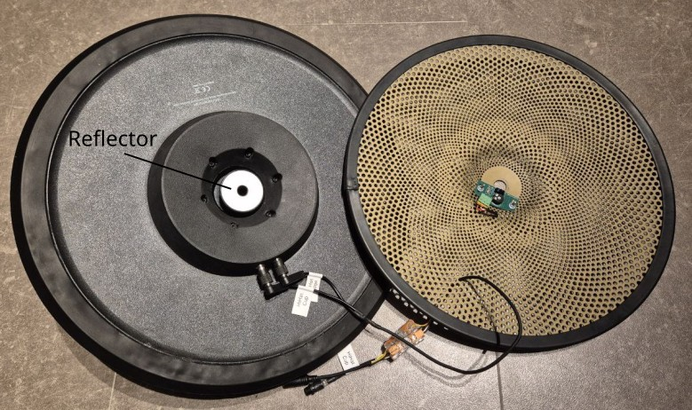

## DIY Optical Hi-Hat sensor

If you need a Hi-Hat sensor here is a simple PCB to build one yourself.

<!-- vscode-markdown-toc -->
* 1. [DIY Optical Hi-Hat sensor](#DIYOpticalHi-Hatsensor)
	* 1.1. [Schematics](#Schematics)
	* 1.2. [Bill of material (BOM)](#BillofmaterialBOM)
	* 1.3. [Connector](#Connector)
	* 1.4. [Adjust IR brightness and sensitivity](#AdjustIRbrightnessandsensitivity)

<!-- vscode-markdown-toc-config
	numbering=false
	autoSave=true
	/vscode-markdown-toc-config -->
<!-- /vscode-markdown-toc -->

### Assembly

The core of the PCB is a cheap TCRT5000 Infrared Reflectance Sensor.

- For the lower part use a 13" Low-Volume Cymbal. You may want to put a rubber rim on it, to reduce the noise.
- For the upper part use a 14" (rubber) Cymbal Pad.
- You will need a reflector on the top cymbal right above the IR sensor to reflect the light.
  - If you can get a reflector of a "real" e-Hi-Hat like the one in the picture above, go for it.
  - A plastic disc with a diameter of 4 cm and black electrical tape on it will probably work too. Put a hole in the middle so that you can screw it onto the Hi-Hat clamp.
    - Make sure the disc is not too reflective (i.e. do not use a CD or a mirror).

### Schematics

All files that you need to order your Hi-Hat Sensor PCB (GERBER file, ...) are [here](https://github.com/tobigun/EavesDrum/releases/tag/PCB-hihat-v1.0.2).

### Bill of material (BOM)

| Component | Designator | Quantity | Price / Unit | Price Total | Comment |
| --------- | ---------- | -------- | ------------ | ----------- | ------- | 
| Potentiometer 5k | R1 | 1 | 0.35€ | 0.35€ | Supports Piher PT10 (10mm) / PT6 (6mm) or Bourns TC33 (SMD) |
| Resistor 100 Ohms | R2 | 1 | 0.03€ | 0.03€ | THT or SMD 0805 package, 125mW (or 250mW), 1% or 5% |
| n/c | R3 | 0 | - | - | Not required, as the EavesDrum module already has a pull-up resistor (R11) on it's ADC2 input |
| TCRT5000 | U1 | 1 | 0.30€ | 0.30€ ||
| 3-Pin Header (male) | J1 | 1 | 0.09€ | 0.09€ ||
| PCB | - | 1 | ~4€* | ~4€* | * Example for 5 PCBs at JLCPCB excl. Shipping/Tax. Shipping/Tax is approx. 2.50€ (Global Direct) or 7.50€ |
| **Total** |||| 24.66€ || 

If you search for a shop for the TCRT5000 and are located in Germany you might want to take a look at BerryBase.

### Connector

| Pin | Function | Comment |
| --- | -------- | ------- |
| 1 | GND | Connect to the `GND` of the EavesDrum Trigger Module. Usually the shield / metal housing of the SUB-D37 connector |
| 2 | OUT | Sensor output. Connect to the `ADC2` pin of the EavesDrum Trigger Module |
| 3 | VCC | Supply Voltage (3.3 or 5V) for the IR LED. Connect to `hh_vcc` of the EavesDrum Trigger Module |

### Adjust IR brightness and sensitivity

You can adjust the brightness of the IR LED as well as the sensitivity of the IR sensor.

For the brightness:
- The Supply voltage of the `hh_vcc` output of the EavesDrum Trigger Module can be switched by the jumper / slide switch `JP6` between 3.3V and 5V.
  - Both should be fine but the IR LED brightness will be higher with 5V.
- You can also regulate the brightness with the potentiometer `R1` on the Hi-Hat sensor module. You can see the brightness of the IR LED with your smartphone camera (as long as it does not have an IR filter).
- It is best to open the EavesDrum drum UI and monitor the Hi-Hat Pedal. This way you can adjust the brightness of the IR LED easily.
  - Just make sure that the signal uses most of the range between 0% and 100%.
  - If the level is near the `closed` level even when the Hi-Hat is fully opened: decrease the brightness.
  - If the level is near 0% even when the Hi-Hat is fully closed: increase the brightness.

For the sensitivity:
- Use potentiometer R11 on the EavesDrum Trigger Module. Simply turn it to the center position. This will probably be good enough.

